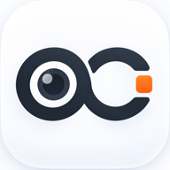
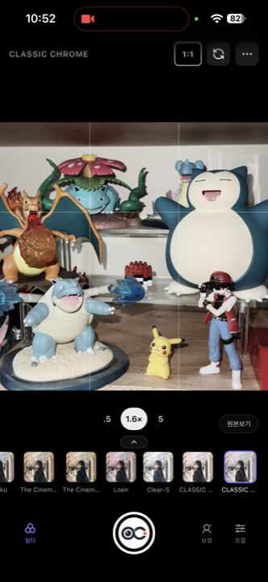

<p align="center">
  
</p>

<h1 align="center">open-camera</h1>

<p align="center">
  iOS 카메라 경험을 목표로 한 설치형 웹 카메라 필터 PWA.<br />
  WebGL2 셰이더 파이프라인 위에서 실시간 필터/프로시저럴 이펙트를 처리합니다.
</p>

<p align="center">
  
  
  
  
</p>

<p align="center">
  <strong><a href="https://open-camera-leneu.vercel.app">▶ Live Demo</a></strong>
  &nbsp;·&nbsp;
  <a href="docs/architecture.md">아키텍처</a>
  &nbsp;·&nbsp;
  <a href="CHANGELOG.md">변경 기록</a>
  &nbsp;·&nbsp;
  <a href="docs/troubleshooting.md">트러블슈팅</a>
</p>

<p align="center">
  
</p>

> **지원 환경**: iOS(Safari/WebKit) 위주로 개발·검증되었습니다.
> UI/제스처/설치 흐름 모두 iOS 기준이며, Android·데스크탑 브라우저에서는
> 동작하더라도 일부 기능(카메라, 설치, 공유 등)이 다르게 동작할 수 있습니다.

## 기능

- **실시간 카메라 프리뷰** — 전/후면 전환, 핀치 줌 + 프리셋 줌 버튼
- **필터** — 프로시저럴 LUT(자체 생성) + HaldCLUT 필름 시뮬레이션, 강도 조절
- **디지캠 이펙트** — JPEG 아티팩트, 저가 렌즈(배럴 왜곡/코너 소프트니스), CCD 블루밍/핫픽셀, 플래시, 수직 스미어, 색수차, 먼지, 라이트 리크, 할레이션, 그레인 등
- **일본풍 프리셋** — UTSURUN / SHINSEN / TOUMEI / MORI / SHOWA / NEON / MIDORI
- **날짜 스탬프** — DSEG7 세그먼트 폰트, 포맷/크기/가로·세로 방향 설정
- **추가 촬영 모드** — 하프프레임, 네 컷(2×2/세로 스트립), 다중노출(평균/밝게/곱하기)
- **최근 촬영 / 다시 현상** — 기기 보관함, 선택 가능한 필터 적용 전 원본 보관
- **카메라 레시피 / 렌즈** — 설정 전체 저장, 선택 가능한 빛줄기·가장자리 굴절과 전후 비교, 전체 룩 강도·은은한 질감·작은 빨간 날짜
- **뷰티/보정** — MediaPipe 얼굴 랜드마크 기반 스킨 스무딩, 눈/턱/코/소두 워프, 블러시/립 등 (최대 3인)
- **사진 편집** — 불러온 사진에 동일 파이프라인 적용, 원본 비교(길게 누르기)
- **커스텀 LUT** — `.cube` / HaldCLUT PNG 다중 import, 이름 변경/삭제, 현재 설정을 LUT로 굽기
- **즐겨찾기/최근 사용** — 필터 즐겨찾기 + 최근 5개
- **PWA** — 홈 화면 설치, 오프라인 동작 (서비스 워커), 고해상도 JPEG 저장/공유

## 기술 스택

- React 19 + Vite + TypeScript
- WebGL2 (3D LUT 텍스처 + 싱글 패스 이펙트 셰이더)
- MediaPipe Face Landmarker (얼굴 인식, lazy-load)
- vite-plugin-pwa + Workbox (서비스 워커)

## 개발

```bash
npm install
npm run dev        # --host로 LAN 공개 (실기기 테스트용)
```

## 빌드 / 검증

```bash
npm run build      # tsc 타입체크 + vite build → dist/
npm run preview    # 빌드 결과 로컬 서빙
npm run typecheck
npx playwright install chromium  # 테스트 브라우저 설치 (최초 1회)
npm test           # LUT·저장·카메라 수명주기·빌드 PWA 브라우저 회귀 테스트
```

## 배포 (Vercel)

`vercel.json` 포함 — 저장소를 Vercel에 연결하면 자동 감지됩니다.

- Framework: **Vite** (자동)
- Build: `npm run build` / Output: `dist`
- `sw.js`·`index.html`은 `no-cache`, `luts|wasm|models`는 immutable 캐시 헤더 적용

CLI 배포: `npx vercel` (프로젝트 루트에서)

### iOS 설치

https://open-camera-leneu.vercel.app 를 Safari로 열고 공유 → **홈 화면에 추가**.
독립 앱으로 동작하며 카메라 권한은 최초 1회만 묻습니다.

## 구조

```
src/
  engine/    WebGL 파이프라인, 셰이더, LUT 파서/프리셋, 날짜 스탬프
  beauty/    MediaPipe 얼굴 추적, 뷰티 마스크/워프 필드
  components/ 필터 스트립/시트, 조절·뷰티 패널, 썸네일, 커스텀 LUT 모달
  camera/    getUserMedia 훅
  utils/     이미지 로딩, LUT 저장소(IndexedDB), 공유
public/
  luts/film/ HaldCLUT 필름 LUT (RawTherapee/Natron, CC BY-SA — CREDITS.md 참조)
  wasm/      MediaPipe WASM 런타임
  models/    face_landmarker.task
docs/        architecture(구조 상세), troubleshooting(이슈/해결 기록),
             beauty-plan(뷰티 설계), lut-provenance(LUT 출처), legal-research(라이선스 리서치)
```

## 커스텀 LUT

햄버거 메뉴 → **LUT 가져오기**에서 `.cube` 또는 HaldCLUT PNG를 선택
(여러 개 동시 선택 가능). 등록된 LUT는 기기 IndexedDB에 저장되며
"커스텀 LUT 관리"에서 이름 변경/삭제할 수 있습니다.
앱 삭제 시 함께 지워지니 원본 파일은 따로 보관하세요.

- PNG/JPEG import는 **512×512, linear HaldCLUT** 레이아웃만 지원합니다.
  일반 사진이나 tiled lookup 텍스처를 넣는 기능이 아닙니다.
- "LUT 만들기"는 현재 LUT·강도와 색상 조절을 새 LUT에 저장합니다.
  성공 후 포함된 색상 조절은 초기화되고 LUT 강도는 100%가 됩니다.
  선명도·명료함·블룸·비네트·그레인·뷰티·프리셋 전용 이펙트는 굽지 않습니다.
  조절 패널의 공간 효과 값은 유지되지만 원래 프리셋 전용 이펙트는 포함되지
  않으므로 모든 효과가 있는 화면과 완전히 같아지는 기능은 아닙니다.
- 생성 도중 설정을 바꿨다면 새 LUT는 목록에만 저장하고 변경한 설정을 유지합니다.
- import는 파싱과 IndexedDB 쓰기 완료를 확인한 후에만 성공을 안내합니다.
- 사진 편집 중에는 카메라를 중지하고, 카메라 모드로 돌아갈 때 다시 시작합니다.

## 추가 촬영 기능

`⋯ → 촬영 모드 · 효과`에서 선택합니다. 기본은 일반 촬영이며 기존 필터값과 주황 날짜는 유지됩니다.

- 하프프레임은 사진 두 장을 나란히 합칩니다. 하프프레임·네 컷은 첫 촬영 전에 한 컷의 비율을 `1:1 / 3:4 / 4:5`에서 선택하며, 촬영·재촬영 중에는 고정됩니다. 일반 촬영 비율은 따로 유지됩니다.
- 하프프레임은 촬영 화면을 큰 두 칸으로, 네 컷은 큰 2×2 칸으로 표시합니다. 찍은 컷은 고정하고 현재 칸만 실시간 카메라로 보여주며, 남은 칸은 대기 상태입니다. 현재 칸에 촬영 순서와 네 컷 카운트다운을 표시합니다. 재촬영 시에도 다른 컷은 유지되며 스트립 배치를 선택한 네 컷은 세로 네 칸으로 표시합니다. 다중노출은 두 장을 겹치며 두 번째 촬영에 첫 장 가이드를 표시합니다.
- 네 컷은 첫 촬영 후 3초 간격으로 이어집니다. 화면을 벗어나거나 메뉴를 열면 일시정지하며 `계속 촬영`으로 재개합니다. 완성 화면에서 개별 컷 재촬영, 배치·여백 색 선택이 가능합니다.
- 합성 사진은 긴 변 최대 2048px입니다. 공유 창을 취소해도 완성 사진은 보관함에 남습니다.
- `원본도 보관`은 기본 꺼짐입니다. RAW가 아닌 크롭·미러 적용 카메라 JPEG를 보관하며 앱 필터·날짜·미용 효과는 넣지 않습니다.
- `⋯ → 최근 촬영` 또는 하단 필터 옆 사진 썸네일로 보관함을 엽니다. 최근 10묶음, 기기 영구 보관은 사진과 원본 합계 50 MiB 한도입니다. 기기/브라우저에만 보관하며 브라우저 데이터 삭제 시 사라집니다. 저장 공간이 없거나 한 묶음이 한도를 넘으면 이번 세션에서 임시로 확인하고 직접 공유/저장할 수 있습니다. 임시 보관은 메모리를 더 사용할 수 있습니다.
- 원본이 있는 사진에서 `다시 현상`하면 새 사진으로 저장합니다. 원래 완성본과 촬영 날짜는 보존합니다. 합성본 재현상에서는 미용 보정을 지원하지 않습니다.
- `⋯ → 카메라 레시피`는 필터·강도·보정·날짜·비율·렌즈 설정을 최대 20개 저장합니다. 사용자 LUT 파일은 포함하지 않으며 누락된 LUT는 적용 전에 안내합니다.
- 작은 빨간 날짜는 `⋯ → 날짜 스탬프 설정 → 빨간 아날로그`에서 선택합니다. 기존 주황 스타일도 그대로 사용할 수 있습니다.
- 렌즈 효과는 `빛줄기`(밝은 조명·반사점) / `가장자리 굴절`(중앙을 유지하고 가장자리 색 분리)입니다. 설정 창을 열 때 멈춘 같은 장면으로 렌즈 없음과 비교합니다. 새 렌즈 효과는 실기기 성능 확인이 필요합니다. 자동 검증은 Chromium 가상 카메라 기준이며 실제 iPhone/Safari의 촬영·공유 검증을 대신하지 않습니다.

## 라이선스 / 출처

- 필름 LUT: RawTherapee Film Simulation / Natron CLUT — **CC BY-SA 4.0**
  (`public/luts/film/CREDITS.md`, 앱 내 메뉴 → 라이선스)
- Lookup 텍스처: GPUImage — BSD (`public/licenses/gpuimage-bsd.txt`)
- 얼굴 인식: MediaPipe — Apache 2.0 (`public/licenses/apache-2.0.txt`)
- 날짜 폰트: DSEG7 — SIL OFL (`public/fonts/LICENSE-dseg.txt`)
- 상표 안내: 필터명의 필름 이름들은 룩 식별 목적이며 각 상표권자와 무관합니다
- 세부 출처 추적: `docs/lut-provenance.md`
