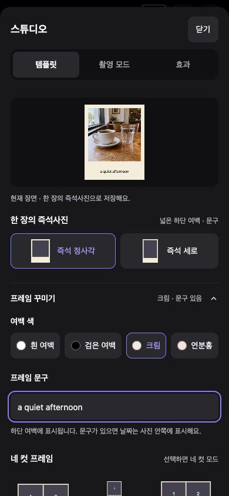
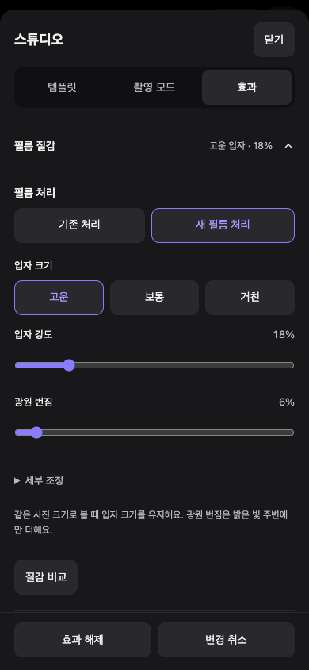

<p align="center">
  
</p>

<h1 align="center">open-camera</h1>

<p align="center">
  iOS 카메라 경험을 목표로 한 설치형 웹 카메라 필터 PWA.<br />
  WebGL2 셰이더 파이프라인 위에서 실시간 필터/프로시저럴 이펙트를 처리합니다.
</p>

<p align="center">
  
  
  
  
</p>

<p align="center">
  <strong><a href="https://open-camera-leneu.vercel.app">▶ Live Demo</a></strong>
  &nbsp;·&nbsp;
  <a href="docs/architecture.md">아키텍처</a>
  &nbsp;·&nbsp;
  <a href="CHANGELOG.md">변경 기록</a>
  &nbsp;·&nbsp;
  <a href="docs/troubleshooting.md">트러블슈팅</a>
</p>

<p align="center">
  
</p>

> **지원 환경**: iPhone Safari / 홈 화면 PWA 사용을 중심으로 개발합니다.
> 자동 회귀 검증은 Chromium 가상 카메라 기준입니다. 실제 iPhone의 화각·발열·공유,
> Android와 다른 브라우저의 동작을 자동 테스트만으로 보장하지 않습니다.

## 2026-10-05 업데이트

색감 필터를 고르는 카메라에서, 촬영 구성과 질감을 함께 만들고 재사용하는 카메라로 확장했습니다.
기존 필터의 색 변환 값과 일반 촬영 기본값은 유지합니다.

| 영역 | 사용할 수 있는 기능 |
| --- | --- |
| 촬영·프레임 | 하프프레임, 자동/수동 네 컷, 다중노출, 즉석 정사각·세로 프레임, 여백 색·하단 문구 |
| 스튜디오 | 템플릿 / 촬영 모드 / 효과 탭, 접이식 세부 설정, 변경 취소·효과 해제 |
| 필터 비교 | 인물·음식·풍경·카페·거리·야간·실내 샘플, 동일 원본 A/B 색감 비교 |
| 필름 | 공개 HaldCLUT 6종 추가, 사용자 제공 `.cube` 2종 별도 등록 |
| 질감 | 선택형 입자 크기·컬러·암부 분포·광원 번짐, 동일 사진의 질감 전후 비교 |
| 재사용 | 카메라 레시피, 매 컷 새 패턴 / 고정 패턴, 선택형 원본 보관·다시 현상 |
| 화면·날짜 | 중앙 정렬 프리뷰, 접고 펼치는 합성 미리보기, 선택형 설정 요약, 바랜 빨강·호박색 날짜 |

대표 룩 후보 6종은 실제 사진 평가 전 단계입니다. `?film-quality-preview=1`로만 시험하며,
일반 목록의 새 LUT 6종과 구분합니다. 영상, 일괄 편집, 필름롤과 추가 인물 보정은 아직 구현하지 않았습니다.

<p align="center">
  
  
</p>

390×844 브라우저 캡처이며, 프레임 사진은 AI 생성 카페 샘플입니다.
[동일 원본 색감 비교](docs/screenshots/2026-10-05-color-comparison.png) ·
[카메라 레시피](docs/screenshots/2026-10-05-recipe.png)

## 기능

- **실시간 카메라 프리뷰** — 전/후면 전환, 웹에서 제공하는 범위의 핀치 줌 + 프리셋 줌 버튼. 전면에는 후면용 3·5배 프리셋을 표시하지 않으며, 현재 전면 트랙의 웹 줌 범위에 포함되는 0.5·1만 사용합니다. 0.5를 지원하지 않거나 범위가 미제공이면 0.5 버튼을 만들지 않고, 선택지가 하나뿐이면 줌 버튼 영역을 숨깁니다. `메뉴 → 카메라 정보`에서 현재 카메라의 방향·해상도·웹 줌 범위와 실제 값을 확인합니다. 웹 줌 값은 기본 카메라 앱의 배율과 다를 수 있습니다.
- **필터** — 프로시저럴 LUT(자체 생성) + HaldCLUT 필름 시뮬레이션, 강도 조절
- **디지캠 이펙트** — JPEG 아티팩트, 저가 렌즈(배럴 왜곡/코너 소프트니스), CCD 블루밍/핫픽셀, 플래시, 수직 스미어, 색수차, 먼지, 라이트 리크, 할레이션, 그레인 등
- **일본풍 프리셋** — UTSURUN / SHINSEN / TOUMEI / MORI / SHOWA / NEON / MIDORI
- **날짜 스탬프** — DSEG7 세그먼트 폰트, 포맷/크기/가로·세로 방향 설정
- **스튜디오** — 네 컷 프레임 6종과 한 장짜리 즉석 프레임 2종, 하프프레임·자동/수동 네 컷·다중노출, 선택형 질감·렌즈 효과
- **최근 촬영 / 다시 현상** — 기기 보관함, 선택 가능한 필터 적용 전 원본 보관
- **카메라 레시피 / 렌즈** — 설정 전체 저장, 선택 가능한 빛줄기·가장자리 굴절과 전후 비교, 전체 룩 강도·은은한 질감·작은 빨간 날짜
- **뷰티/보정** — MediaPipe 얼굴 랜드마크 기반 스킨 스무딩, 눈/턱/코/소두 워프, 블러시/립 등 (최대 3인)
- **사진 편집** — 불러온 사진에 동일 파이프라인 적용, 원본 비교(길게 누르기)
- **커스텀 LUT** — `.cube` / HaldCLUT PNG 다중 import, 이름 변경/삭제, 현재 설정을 LUT로 굽기
- **즐겨찾기/최근 사용** — 필터 즐겨찾기 + 최근 5개
- **PWA** — 홈 화면 설치, 오프라인 동작 (서비스 워커), 고해상도 JPEG 저장/공유

## 기술 스택

- React 19 + Vite + TypeScript
- WebGL2 (3D LUT 텍스처 + 싱글 패스 이펙트 셰이더)
- MediaPipe Face Landmarker (얼굴 인식, lazy-load)
- vite-plugin-pwa + Workbox (서비스 워커)

## 개발

```bash
npm install
npm run dev        # --host로 LAN 공개 (실기기 테스트용)
```

## 빌드 / 검증

```bash
npm run build      # tsc 타입체크 + vite build → dist/
npm run preview    # 빌드 결과 로컬 서빙
npm run typecheck
npx playwright install chromium  # 테스트 브라우저 설치 (최초 1회)
npm test           # LUT·저장·카메라 수명주기·빌드 PWA 브라우저 회귀 테스트
```

## 배포 (Vercel)

`vercel.json` 포함. 현재 프로젝트에 Git 연결이 없는 상태를 2026-10-05에 확인했으며,
운영 배포에는 Vercel CLI를 사용합니다. 저장소를 연결하면 Git 자동 배포를 구성할 수 있습니다.

- Framework: **Vite** (자동)
- Build: `npm run build` / Output: `dist`
- `sw.js`·`index.html`은 `no-cache`, `luts|wasm|models`는 immutable 캐시 헤더 적용

`git push`와 운영 배포 완료는 같은 의미가 아닙니다. Vercel의 Git 연결 및 Production Branch를
확인하고, 배포의 Ready 상태와 실제 운영 주소의 새 번들을 확인합니다.
Git 자동 배포가 연결되지 않았다면 프로젝트 루트에서 `npx vercel --prod`를 사용합니다.

### iOS 설치

https://open-camera-leneu.vercel.app 를 Safari로 열고 공유 → **홈 화면에 추가**.
독립 앱으로 동작하며 카메라 권한은 최초 1회만 묻습니다.

## 구조

```
src/
  engine/    WebGL 파이프라인, 셰이더, LUT 파서/프리셋, 날짜 스탬프
  beauty/    MediaPipe 얼굴 추적, 뷰티 마스크/워프 필드
  components/ 필터 스트립/시트, 조절·뷰티 패널, 썸네일, 커스텀 LUT 모달
  camera/    getUserMedia 훅
  utils/     이미지 로딩, LUT 저장소(IndexedDB), 공유
public/
  luts/film/ HaldCLUT 필름 LUT (RawTherapee/Natron, CC BY-SA — CREDITS.md 참조)
  wasm/      MediaPipe WASM 런타임
  models/    face_landmarker.task
docs/        architecture(구조 상세), troubleshooting(이슈/해결 기록),
             beauty-plan(뷰티 설계), lut-provenance(LUT 출처), legal-research(라이선스 리서치)
```

## 커스텀 LUT

`⋯ → LUT 가져오기`에서 `.cube` 또는 HaldCLUT PNG를 선택
(여러 개 동시 선택 가능). 등록된 LUT는 기기 IndexedDB에 저장되며
"커스텀 LUT 관리"에서 이름 변경/삭제할 수 있습니다.
브라우저의 사이트 데이터를 삭제하면 사라질 수 있으니 원본 파일은 따로 보관하세요.

- PNG/JPEG import는 **512×512, linear HaldCLUT** 레이아웃만 지원합니다.
  일반 사진이나 tiled lookup 텍스처를 넣는 기능이 아닙니다.
- "LUT 만들기"는 현재 LUT·강도와 색상 조절을 새 LUT에 저장합니다.
  성공 후 포함된 색상 조절은 초기화되고 LUT 강도는 100%가 됩니다.
  선명도·명료함·블룸·비네트·그레인·뷰티·프리셋 전용 이펙트는 굽지 않습니다.
  굽지 않은 효과는 현재 설정에 별도로 유지되며 LUT 파일 안에 포함되지 않습니다.
  생성 결과는 512×512 PNG HaldCLUT로 기기에 등록됩니다. `.cube` 다운로드나
  외부 편집기로 내보내는 기능은 제공하지 않습니다.
- 생성 도중 설정을 바꿨다면 새 LUT는 목록에만 저장하고 변경한 설정을 유지합니다.
- import는 파싱과 IndexedDB 쓰기 완료를 확인한 후에만 성공을 안내합니다.
- 사진 편집 중에는 카메라를 중지하고, 카메라 모드로 돌아갈 때 다시 시작합니다.

### LUT와 카메라 레시피는 다릅니다

| 저장 방식 | 포함하는 내용 | 포함하지 않는 내용 |
| --- | --- | --- |
| LUT 만들기 | 현재 LUT·강도와 색상 조절을 합친 색 변환 | 입자·번짐·렌즈·뷰티·날짜·프레임 |
| 카메라 레시피 | 필터 ID·강도, 색상/공간 보정, 뷰티, 날짜, 렌즈, 비율, 필름 질감과 추가 패턴 설정 | 사진, 사용자 LUT 파일, 템플릿·자동 촬영 구성 |

`⋯ → 카메라 레시피`에서 이름을 입력하고 **현재 설정 저장**을 누릅니다. 최대 20개를
같은 기기·브라우저에서 저장/적용/이름 변경/삭제할 수 있습니다. 사용자 LUT를 사용하는
레시피는 해당 LUT가 기기에 있어야 합니다. 공유·파일 내보내기·기기 간 동기화는 없습니다.
고정 패턴은 그대로 복원하고, 매 컷 모드는 새 패턴으로 시작합니다.
나만의 색감과 질감을 함께 재사용하려면 LUT를 만든 뒤 레시피도 저장합니다.

## 같은 사진으로 색감과 질감을 비교합니다

- `필터 전체 보기`에서 인물·음식·풍경·카페·거리·야간·실내의 AI 생성 기준 사진을 선택합니다.
  사진을 바꿔도 필터 자체가 달라지는 것은 아닙니다.
- 비교 소스는 샘플, 멈춘 현재 장면, 편집 사진, 보관된 필터 적용 전 원본입니다.
  원본을 보관하지 않은 완성 사진은 원본 기반 색감 비교를 할 수 없습니다.
- A/B 색감 비교는 같은 원본에 두 LUT와 각 강도를 적용합니다. 적용은 선택한 필터·강도만
  바꾸며 기존 질감 등 나머지 설정을 보존합니다.
- 필터와 입자를 함께 줄이고 싶으면 **전체 룩** 강도, 색 변환만 줄이고 싶으면 **색상만**을 선택합니다.
- `스튜디오 → 효과 → 필름 질감 → 새 필름 처리`는 명시적으로 선택해야 켜집니다.
  고운/보통/거친 입자, 입자 강도·광원 번짐, 세부 입자 크기·컬러·암부·번짐 범위를 조절합니다.
  질감 비교는 같은 사진을 멈춰 놓고 켜기 전후를 보여주며 별도의 적용 버튼은 없습니다.
- 추가 입자·빛샘·먼지·색 편차는 패턴 고정 또는 매 컷 변경을 선택할 수 있습니다.
  하프/네 컷은 첫 컷 이후 공통 질감과 레시피 변경을 잠가 구성의 일관성을 유지합니다.

## 추가된 필름 데이터

- **필름 컬렉션**: FUJI 160C, SUPERIA 400, ULTRA COLOR 100, ELITE CHROME 200,
  INSTANT 690, NEOPAN 1600. Pat David / Natron CLUT의 CC BY-SA 4.0 데이터이며
  제조사 공식 LUT나 실제 필름의 정확한 재현을 보장하지 않습니다.
- **추가 필름**: MUTED CHROME, DEEP NEGATIVE. 사용자가 제공한 `.cube`의 표시 이름만
  변경했습니다. 색 변환 값은 그대로이며 출처·역추출 방법·재배포 조건은 미확인입니다.
  공개 필름 컬렉션의 라이선스를 이 두 파일에 적용하지 않습니다.
- **빈티지 질감 프리셋**: 구형 디지캠·일회용 필름·바랜 인화사진은 저장 시 축소와 JPEG 압축으로
  디테일을 의도적으로 낮춥니다. 실시간 미리보기는 가벼운 GPU 근사이므로 저장 결과와 다를 수 있습니다.
- **대표 룩 · 시험중**: 기존 색 데이터에 새 질감을 조합한 6개 후보입니다. 새 LUT 파일 6개가 아닙니다.
  [평가 상태](docs/signature-film-evaluation.md)와 [검증·제한](docs/signature-film-quality-verification.md)을 참고합니다.

## 추가 촬영 기능

하단 `스튜디오`에서 `템플릿 / 촬영 모드 / 효과` 탭으로 선택합니다. 기존 `⋯ → 촬영 모드 · 효과` 바로가기도 유지됩니다. 기본은 일반 촬영이며 기존 필터값과 주황 날짜는 유지됩니다.

- 네 컷 템플릿은 기본 2×2, 클래식 스트립, 메모리 2×2, 메모리 스트립, 가로 네 컷, 필름 스트립의 6종입니다. 메모리 프레임에는 하단 여백을 넓게 남기며, 필름 스트립에는 필름 구멍 모양을 표시합니다. 기존 사진을 쓰거나 외부 브랜드 프레임을 복제하지 않은 자체 도형 구성입니다. 선택 그림은 배치 예시이고, 실제 촬영 화면에는 현재 장면과 찍은 사진을 같은 배치로 표시합니다.
- 즉석 정사각·즉석 세로는 한 장으로 완성합니다. 여백은 흰색·검은색·크림·연분홍을 선택하고,
  하단 문구를 지원하는 프레임에는 짧은 글을 넣습니다. 결과 화면에서도 변경할 수 있습니다.

- 하프프레임은 사진 두 장을 나란히 합칩니다. 하프프레임·네 컷은 첫 촬영 전에 한 컷의 비율을 `1:1 / 3:4 / 4:5`에서 선택하며, 촬영·재촬영 중에는 고정됩니다. 일반 촬영 비율은 따로 유지됩니다.
- 하프프레임·네 컷도 메인 촬영 화면은 현재 찍을 한 컷을 크게 보여줍니다. 오른쪽 아래 합성 미리보기에서 선택한 프레임의 2칸·2×2·세로 네 칸·가로 네 칸 배치를 확인합니다. 찍은 컷은 고정하고 현재 칸만 실시간 카메라로 보여주며, 남은 칸은 대기 상태입니다. 미리보기는 확대·축소·접기가 가능하고, 접으면 촬영 순서만 표시하는 버튼으로 바뀝니다. 카메라 줌·촬영 비율·저장 결과에는 영향을 주지 않습니다. 짧은 가로 화면에서는 창이 필터 목록 위까지 펼쳐질 수 있지만 헤더와 셔터는 가리지 않습니다.
- 합성 미리보기는 검정 배경 65%·사진 90%의 표시 불투명도로 장면이 살짝 비칩니다. 글씨와 버튼은 함께 흐려지지 않으며, 실제 저장 사진에는 투명도를 적용하지 않습니다.
- 네 컷 자동 촬영 카운트다운은 합성 창을 접어도 메인 화면에 크게 표시합니다. 창 크기를 바꾸거나 접어도 자동 촬영은 계속되며, 재촬영 시에도 다른 컷과 창의 표시 상태는 유지됩니다. 다중노출은 기존처럼 두 장을 겹치며 두 번째 촬영에 첫 장 가이드를 표시합니다.
- `스튜디오 → 촬영 모드`에서 네 컷의 `자동 / 수동`과 자동 간격 `3 / 5 / 10초`를 선택합니다. 촬영 화면의 빠른 선택도 유지합니다. 자동은 첫 컷을 셔터로 찍으면 선택한 간격으로 이어지며, `일시정지 / 계속 촬영`으로 조절합니다. 화면을 벗어나거나 메뉴·스튜디오를 열어도 자동 촬영은 일시정지합니다. 수동은 셔터를 누를 때마다 한 컷씩 찍습니다. 촬영 방식과 간격은 첫 컷 이후 고정되며, 다음 촬영에서도 선택한 방식을 유지합니다(새로고침 시 기본 자동).
- 완성 화면에는 실제 컷별 썸네일이 표시되며, 썸네일을 선택하면 해당 컷만 다시 촬영합니다. `배치 · 여백`을 펼쳐 프레임 6종과 여백 색을 선택할 수 있습니다. 프레임을 바꿔도 촬영한 네 장은 유지되고, 저장·원본 재현상에도 선택한 프레임을 사용합니다. `공유 / 저장`은 하단에 고정되며, 닫기·화면 바깥 누르기·Escape로 종료할 때는 촬영을 버릴지 확인합니다.
- 합성 사진은 긴 변 최대 2048px입니다. 공유 창을 취소해도 완성 사진은 보관함에 남습니다.
- `원본도 보관`은 기본 꺼짐입니다. RAW가 아닌 크롭·미러 적용 카메라 JPEG를 보관하며 앱 필터·날짜·미용 효과는 넣지 않습니다.
- `⋯ → 최근 촬영` 또는 상단 비율 버튼 왼쪽 사진 썸네일로 보관함을 엽니다. 사진이 없으면 썸네일을 표시하지 않습니다. 최근 10묶음, 기기 영구 보관은 사진과 원본 합계 50 MiB 한도입니다. 기기/브라우저에만 보관하며 브라우저 데이터 삭제 시 사라집니다. 저장 공간이 없거나 한 묶음이 한도를 넘으면 이번 세션에서 임시로 확인하고 직접 공유/저장할 수 있습니다. 임시 보관은 메모리를 더 사용할 수 있습니다.
- 원본이 있는 사진에서 `다시 현상`하면 새 사진으로 저장합니다. 원래 완성본과 촬영 날짜는 보존합니다. 합성본 재현상에서는 미용 보정을 지원하지 않습니다.
- 효과 탭의 `변경 취소`는 스튜디오 진입 전 효과를 복원하고, `효과 해제`는 필름·렌즈·추가 질감을 해제합니다. 일반 닫기는 변경을 유지합니다. 템플릿·뷰티·보정·날짜·원본 보관을 전부 초기화하는 기능은 아닙니다.
- `⋯ → 설정 요약 표시`는 기본 꺼짐인 접이식 요약입니다. `전체 설정 보기`에서 저장값과 실제 사용값을 구분하고 해당 편집 화면으로 이동합니다.
- 작은 빨간 날짜는 `⋯ → 날짜 스탬프 설정 → 빨간 아날로그`에서 선택합니다. 기존 주황 스타일도 그대로 사용할 수 있습니다.
- 렌즈 효과는 `빛줄기`(밝은 조명·반사점) / `가장자리 굴절`(중앙을 유지하고 가장자리 색 분리)입니다. 설정 창을 열 때 멈춘 같은 장면으로 렌즈 없음과 비교합니다. 새 렌즈 효과는 실기기 성능 확인이 필요합니다. 자동 검증은 Chromium 가상 카메라 기준이며 실제 iPhone/Safari의 촬영·공유 검증을 대신하지 않습니다.

## 라이선스 / 출처

- 필름 LUT: RawTherapee Film Simulation / Natron CLUT — **CC BY-SA 4.0**
  (`public/luts/film/CREDITS.md`, 앱 내 메뉴 → 라이선스)
- Lookup 텍스처: GPUImage — BSD (`public/licenses/gpuimage-bsd.txt`)
- 얼굴 인식: MediaPipe — Apache 2.0 (`public/licenses/apache-2.0.txt`)
- 날짜 폰트: DSEG7 — SIL OFL (`public/fonts/LICENSE-dseg.txt`)
- 사용자 제공 LUT 2종: **라이선스 미확인**, 공개 필름 컬렉션과 별도
  (`public/luts/provided/CREDITS.md`)
- 상표 안내: 필터명의 필름 이름들은 룩 식별 목적이며 각 상표권자와 무관합니다
- 세부 출처 추적: `docs/lut-provenance.md`
